# CATopalian JavaScript Markdown to HTML Editor
A JavaScript app that allows the user to Type or Load Markdown formatted text into a texarea and then converts it to HTML in the other textarea. The converted text can be downloaded as an HTML file. This app is a Markdown to HTML Editor.

---

Video: https://www.youtube.com/watch?v=JmkKWgdGg9M

Use App: https://christopherandrewtopalian.github.io/CATopalian_JavaScript_Markdown_to_HTML_Editor/CATopalian_JavaScript_Markdown_to_HTML_Editor.html

---

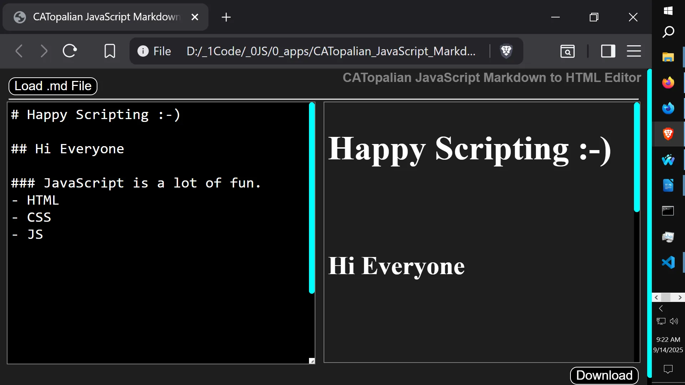  

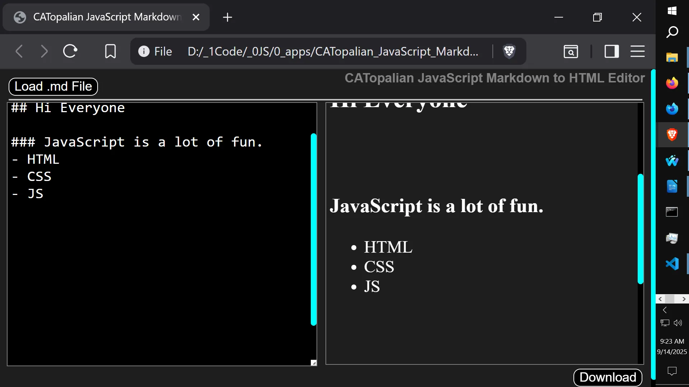  

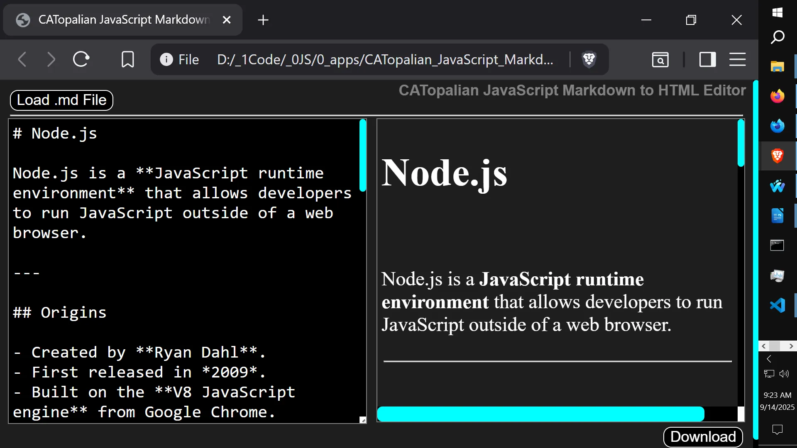  

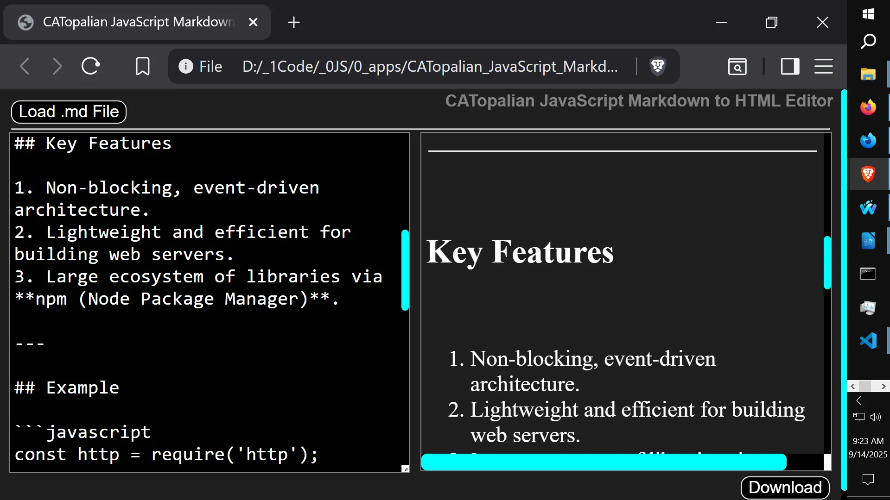  

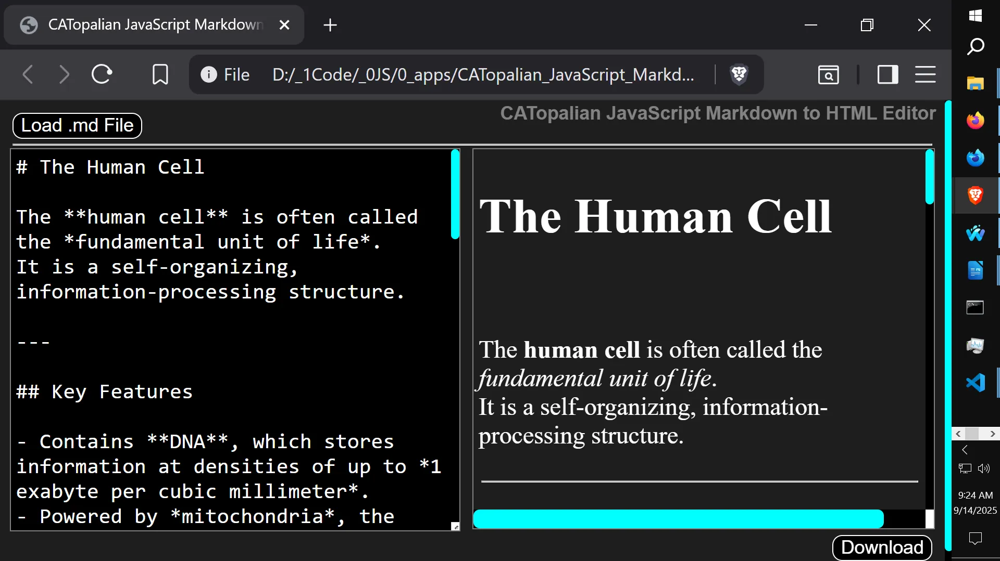  

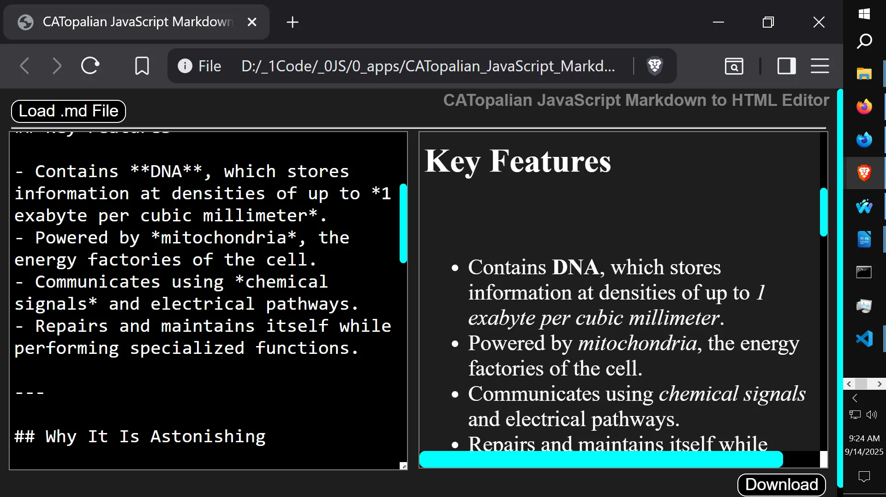  

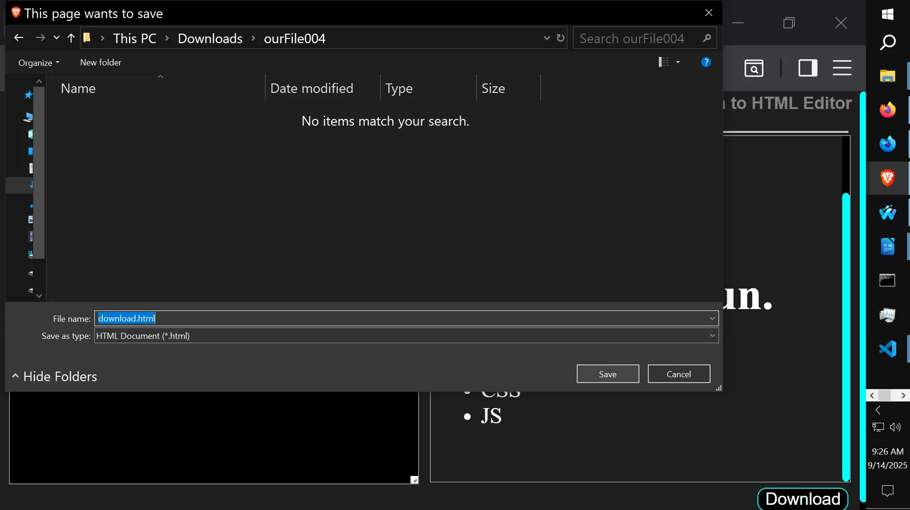  

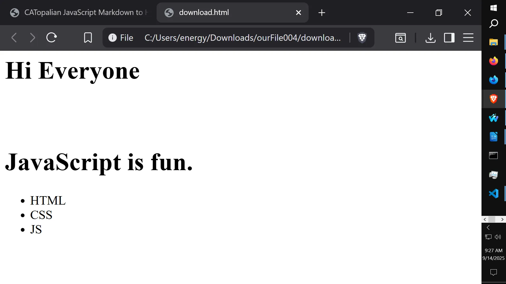  

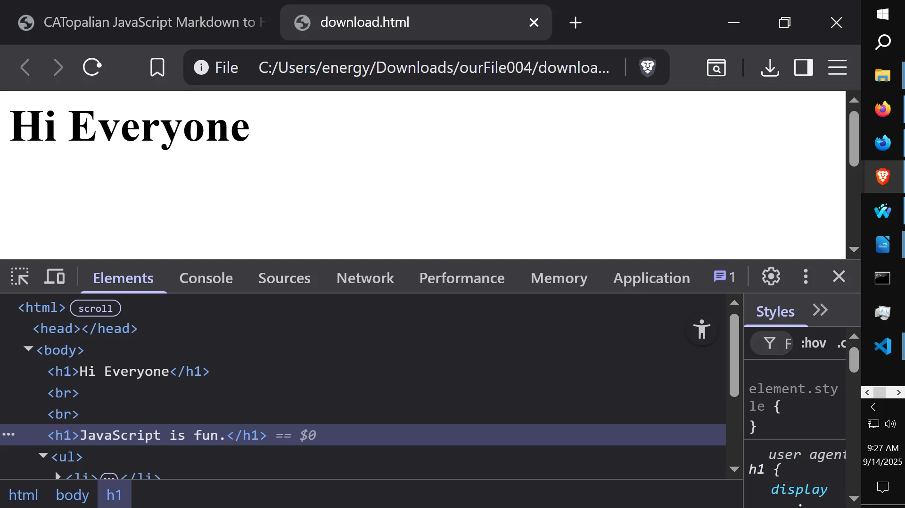  

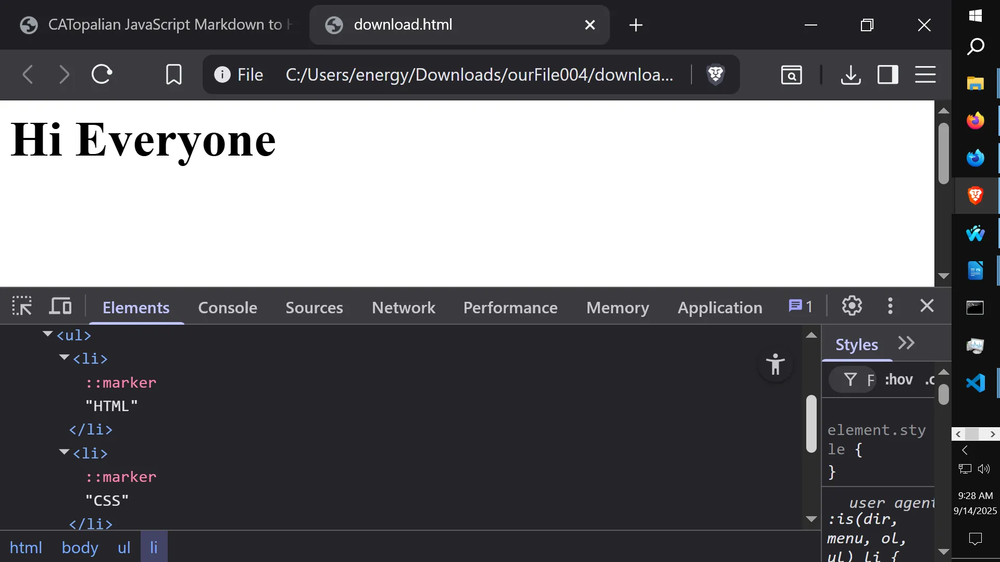  

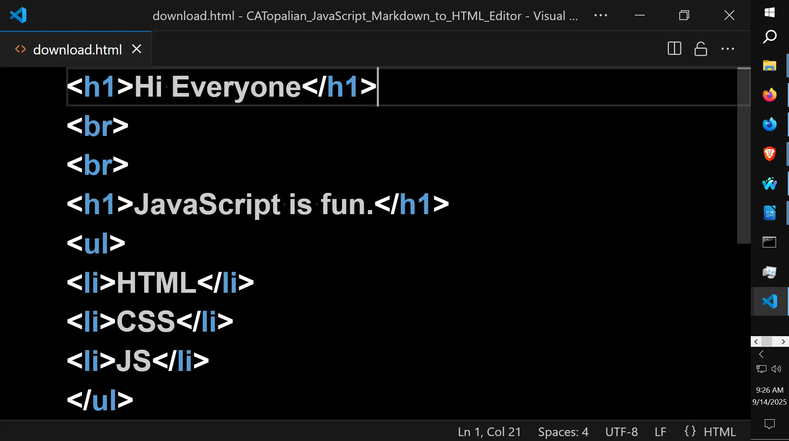  

---

---

How to Download this App
1. Click the green Code Button on this github page
2. Choose Download ZIP
3. Save the Zip File
4. Extract All
5. Double click the HTML file to start the App

---

//----//

// Dedicated to God the Father  
// All Rights Reserved Christopher Andrew Topalian Copyright 2000-2025  
// https://github.com/ChristopherTopalian  
// https://github.com/ChristopherAndrewTopalian  
// https://sites.google.com/view/CollegeOfScripting

